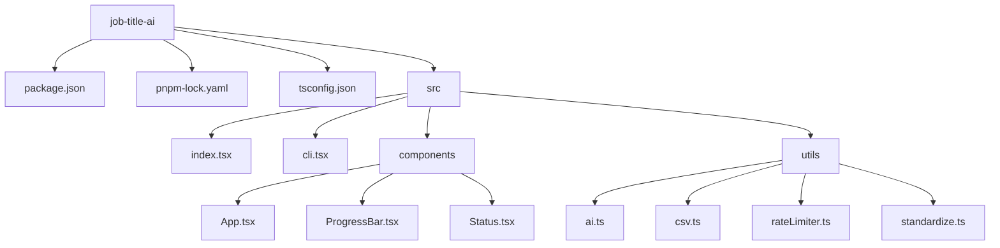
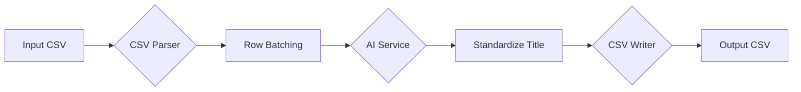

# Project Plan: AI-Powered Job Title Standardization CLI

This plan outlines the architecture and implementation of a CLI tool to process and standardize job titles from a large CSV file using AI.

## 1. Project Structure

We'll organize the project with a clear and scalable structure.

*   `package.json`: Defines project metadata, scripts, and dependencies.
*   `pnpm-lock.yaml`: Ensures deterministic dependency installation.
*   `tsconfig.json`: TypeScript configuration.
*   `src/index.tsx`: Main entry point for the CLI.
*   `src/cli.tsx`: Handles command-line arguments and options.
*   `src/components/App.tsx`: The main React Ink component.
*   `src/components/ProgressBar.tsx`: A component to display the progress of the CSV processing.
*   `src/components/Status.tsx`: A component to display the current status of the CLI (e.g., "Processing batch 5 of 100").
*   `src/utils/ai.ts`: Contains the logic for interacting with the Google GenAI SDK.
*   `src/utils/csv.ts`: Handles CSV parsing and writing.
*   `src/utils/rateLimiter.ts`: Implements the rate-limiting logic.
*   `src/utils/standardize.ts`: Contains the `getStandardizedJobTitle()` function.

## 2. Data Flow

The data will flow through the application in a series of steps:

1.  **CSV Parsing:** The input CSV is read as a stream to handle large files efficiently.
2.  **Row Batching:** Rows are grouped into batches of a configurable size (default: 100).
3.  **AI Service:** Each batch is sent to the Google GenAI SDK for processing.
4.  **Standardize Title:** The `getStandardizedJobTitle()` function is applied to the AI output.
5.  **CSV Writer:** The enriched data is written to a new CSV file.

## 3. Core Components

*   **`src/utils/ai.ts`**: This will contain the main AI interaction logic. It will include the `GoogleGenAI` client setup, the `config` object with the response schema, and the `buildAIPrompt` function. We'll create a function that processes a *single* job title row and returns a promise. We'll then use a rate-limiting library like `p-limit` to execute these promises in parallel for each batch.

*   **`src/utils/standardize.ts`**: This file will hold the deterministic `getStandardizedJobTitle()` and `capitalize()` functions.

*   **`src/utils/csv.ts`**: This will handle reading the CSV stream, grouping rows into batches, and passing them to our AI processing function.

*   **`src/cli.tsx` & `src/components/`**: These will handle the user interface and command-line argument parsing.

## 4. Implementation Steps

1.  **Project Setup**: Initialize the `pnpm` project, install dependencies (`react`, `ink`, `fast-csv`, `p-limit`, `@google/generative-ai`, `yargs`), and set up `tsconfig.json`.
2.  **Integrate Core Logic**:
    *   Place `getStandardizedJobTitle` and `capitalize` functions into `src/utils/standardize.ts`.
    *   Adapt AI logic into `src/utils/ai.ts` to process a single row asynchronously.
3.  **Implement Batch Processing**: Use `fast-csv` to read the input file and `p-limit` to process the batches in parallel, calling the function from `ai.ts` for each row.
4.  **Build UI & CLI**: Develop the React Ink components and wire up the command-line options.
5.  **Final Assembly & Testing**: Bring all the pieces together and test with a sample CSV.